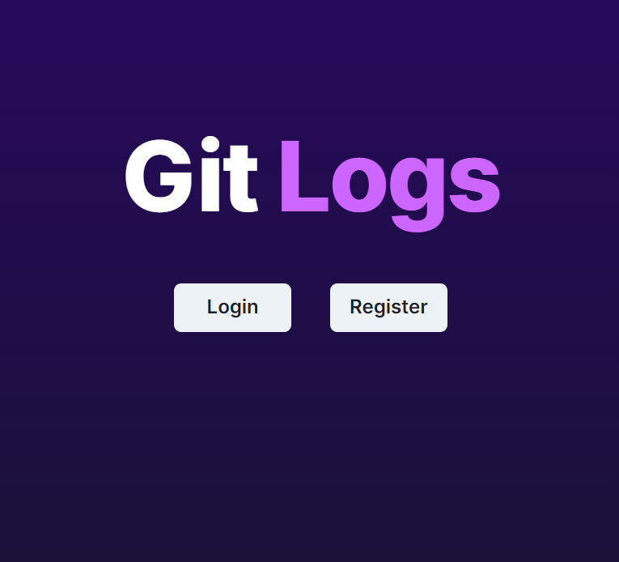
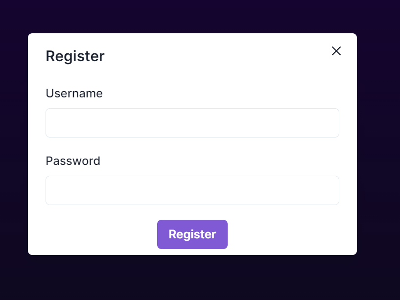
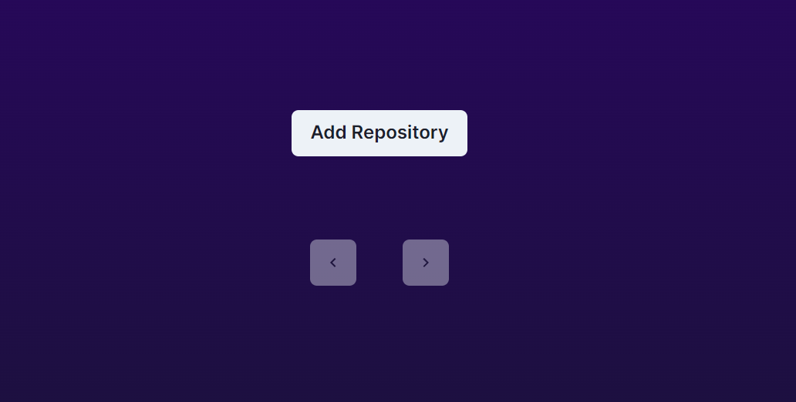
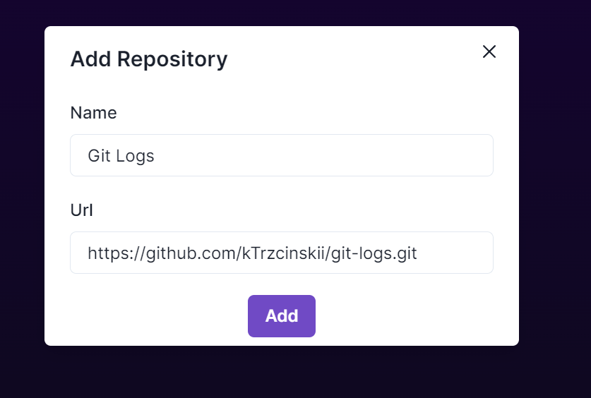
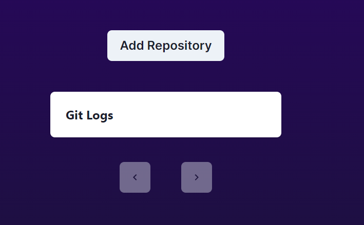
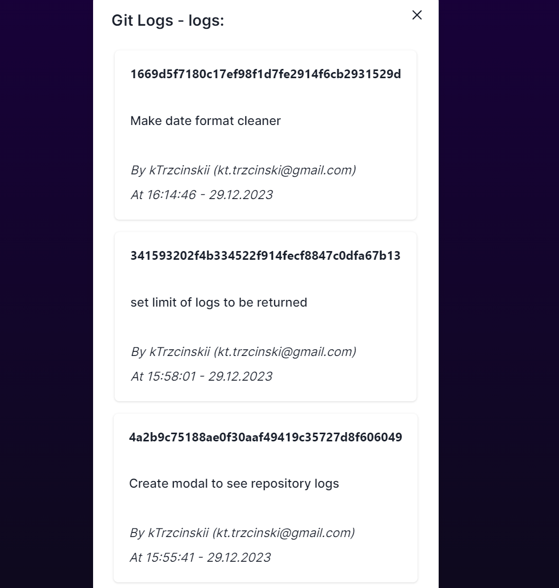

# Git Logs

Git Logs is an application that lets you check the logs of any public git repository. It is built with Java on the backend and Typescript on the frontend.

## Usage

When you open the app you should see the main page:

When you're using app for the first time, you should register - otherwise please login to existing account.

After doing it you will be redirected to "/dashboard" page:

Please click "Add Repository" to add new repository to your account (remember, this should be public repository and the link to it should be at least 10 characters long).

After successfully adding repository to your account you should see it in the list:

After clicking the card with repository name you will see modal with last 30 logs of this repository.

## Running Locally

To run project on your machine, you have to run both frontend and backend.

### Backend

Here are the steps you need to follow to run backend:

- Enter backend folder (`$ cd git-logs-server`)
- Start database (`$ docker-compose up`)
- Start spring application

### Frontend

To run the frontend you need to:

- Enter frontend folder (`$ cd git-logs-front`)
- Start NextJS application (`$ npm run dev`)

## Important Note

Please remember that this project is for educational purpose only and it lacks a lot of features to be ready for production. You should never keep your secrets visible and you should properly handle all of possible errors.
